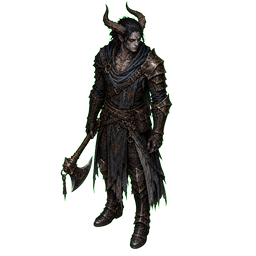
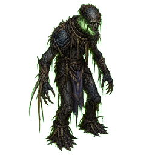
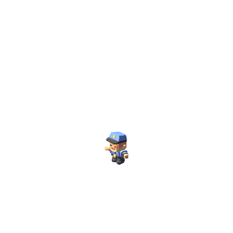

# Unit calibration contact sheet

Calibration batch only: Vex the Unbowed and Bog Wight. Each preview is shown at 3×
the 64×32 gameplay tile width for silhouette and palette review. The comparison
render is an existing Kenney-derived character render and is included unchanged.

| Vex the Unbowed | Bog Wight | Existing Kenney-derived render |
|---|---|---|
|  |  |  |

Fixed contract: orthographic, 45° yaw, 26.565° pitch, 256×256 transparent RGBA,
bottom-center feet pivot, restrained charcoal / blue-black / tarnished bronze palette.
