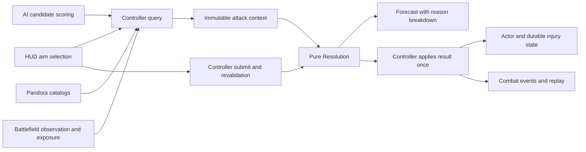

# Called shots, accuracy, and injuries

**Status:** Architecture proposed 2026-09-17; accuracy-foundation implementation started 2026-09-18. Confirmed rules and implemented behavior are distinguished below; remaining gameplay rules and balance are proposals.

**Requested direction:** Expand Soul Meter's turn-based combat toward Fallout 2's aimed attacks and situational accuracy, replacing the groin target with the **throat**. Include line of sight, environmental conditions, and injuries.

**Implementation checklist:** [Called-shot expansion tasks](../../tasks/called-shots-and-injuries.md).

**2026-09-18 continuation:** Added the treatment/recovery contract and split its implementation into verifiable slices. The user confirmed that qualified Mending can cure serious injuries outside combat. Exact qualification thresholds, supply costs, and treatment success rules remain recommendations.

## Recommended shape

Build one aiming system that serves ordinary attacks, anatomical called shots, and discovered Defining Strike weaknesses. Show the chance and its causes before commitment. A successful called shot can produce a location-specific injury; choosing a location does not guarantee a disabling effect.

The first playable encounter should support **torso, arm, and throat**, with clear versus dim conditions, partial cover, and a vocal opponent. Expand anatomy after this loop is understandable and tactically useful. Preserve same-map combat, party play, the existing schedulers, and the Elements & Music economy.

### Decisions and their status

| Decision | Status |
|---|---|
| Called shots, throat replacing groin, situational accuracy, injuries | Requested by the user; in scope for this plan |
| One resolver shared by forecast, execution, replay, and AI | Recommended architecture using existing boundaries |
| Visible anatomy needs no Lore roll; hidden/supernatural weaknesses retain discovery requirements | Confirmed by the user, 2026-09-18; FR-103 amended. Anatomy selection is not implemented yet. |
| Aiming adds an action cost as well as an accuracy penalty; AP/CT surcharges are authored separately | Confirmed by the user, 2026-09-18; first values remain provisional lab tuning |
| Location difficulty, aim surcharge, injury chances/severities, environmental penalties | Proposed tuning; not settled numbers |
| Serious injuries persist beyond combat until treated | Confirmed by the user, 2026-09-17; persistence and treatment are required scope |
| Qualified Mending can cure serious injuries outside combat | Confirmed by the user, 2026-09-18; field cures are required scope |

## Existing foundation and design amendments

| Existing source | Implication for the expansion |
|---|---|
| [Game identity](../game-identity.md) | Preserve Fallout lineage, same-map encounters, class identity, and acts of Agreement as the source of Soul income. |
| [Chapter-one PRD](../prd-chapter-one.md), FR103 | Amended 2026-09-18 to permit freely targeted exposed anatomy while preserving discovery for hidden/supernatural weaknesses. The new anatomy selector remains planned. |
| [Martial rules proposal](martial-combat-rules.md) | Retain weapon identities and explicit AP/CT authoring. Its avoidance of a new critical roll needs an explicit amendment if conditional injury rolls are adopted. |
| [Resolution](../../globals/combat/resolution.gd) | Already deterministic and shared. Current provisional accuracy is 70 + 2 × Alacrity difference + facing + 4 × height difference, clamped to 5–95 when to-hit resolution is enabled. Preserve the baseline while adding explainable inputs. |
| [Combat controller](../../globals/combat/combat_controller.gd) | Owns legality, costs, forecasts, and effect application. Defining Strikes add a knowledge check and now require a confirmed physical hit before applying their effect. Cover still reduces damage here. |
| [Grid battlefield](../../globals/combat/grid_battlefield_model.gd) | Has range, elevation, cover, and binary LOS. Extend this query boundary for exposure; audit hard terrain blockers instead of assuming existing LOS handles every wall. |
| [Combat rules](../../globals/combat/combat_rules.gd) | Supports AP-round and charge-time schedulers. Charge time is not universally enabled; called shots must support both without inventing an AP-to-CT conversion. |
| [Spell-card rules](spell-card-rules.md) | Muted resets Tempo; it is not persistent silence. Elemental statuses and physical injuries need separate contracts. |

### Implemented accuracy foundation — 2026-09-18

The resolver now returns an additive data-only `accuracy_breakdown`: base, named percentage-point modifiers, pre-clamp chance, clamp adjustment, and effective chance (including legacy automatic/guaranteed hits). Existing deterministic outcomes, costs, and the provisional curve are unchanged. Controller legality reasons still reach the forecast before chance calculation.

Forecast payloads add `damage_on_hit`, calculated through the same resolver and mitigation path under a hypothetical landed, non-fizzled action. Existing raw `damage`/`resolution` fields remain compatible for replay/parity consumers. The HUD displays conditional damage, actual hit/fizzle risks, and named accuracy terms; it omits future hit-roll labels and unrevealed hidden-draw rows. The Defining Strike dialog distinguishes knowledge success from physical accuracy, and its effect application now requires a physical hit.

[Focused tests and rendered evidence](../qa/combat-accuracy-2026-09-18.md). No anatomy selector, aim surcharge, environmental accuracy term, or new injury state is enabled by this foundation slice.

### What to borrow from Fallout

Borrow the decision structure: spend more effort aiming, trade accuracy for a specific consequence, and use position or conditions to improve the attempt. The [Fallout 2 Community Edition combat implementation](https://github.com/alexbatalov/fallout2-ce/blob/main/src/combat.cc) includes location penalties and location-specific critical effects, with accuracy affected by weapon skill, distance, illumination, intervening creatures, and blindness. It is a reimplementation reference, not an official rules specification. Soul Meter should use its own attributes, skills, timing, and authored anatomy rather than copy those numerical tables.

## Player-facing rules

### Choose an attack, a target, and an aim

An ordinary attack remains the fastest interaction. An Aim control opens the target's available locations; the player sees hit chance, additional AP or CT cost, and a concise possible effect before committing. Canceling or inspecting a target spends nothing.

Use authored anatomy, not a universal human silhouette. A humanoid can expose torso, head/eyes, left/right arms, left/right legs, and throat; another creature can omit or replace these. Missing or fully covered parts cannot be selected. Obvious parts are available without discovery checks. Discovered supernatural or narrative weaknesses appear alongside anatomy with their existing knowledge requirements.

| Location family | Proposed tactical purpose | Constraint |
|---|---|---|
| Torso | Reliable damage, smallest aiming penalty | Ordinary attack remains useful; no free disabling effect |
| Arms/hands | Impair attacks using the injured limb or weapon | Handedness and weapon use must be authored; no universal stat penalty |
| Legs | Impair movement or positional recovery | Express costs through the active scheduler; avoid unavoidable permanent immobility |
| Head/eyes | Difficult disruption or impaired sight | Severe outcomes need separate rarity/resistance tuning; no automatic stun lock |
| Throat | Disrupt explicitly vocal actions | Does not automatically block all magic or reuse the Muted status |

**Throat proposal:** a minor injury penalizes eligible vocal actions; a severe injury can prevent actions explicitly requiring an intact voice until recovery. Severity, duration, and interruption of an already committed action require authored rules. An action's element or spell classification alone does not establish vocal dependence. Provide a viable nonvocal action before allowing a severe throat effect in playable content.

Add action delivery metadata such as `requires_voice` and limb requirements. Validate it against class cards and lore before production authoring. Any interaction with held notes, pending casts, or sustained workings must use their existing lifecycle and reaction contracts. Do not silently remove all Aftertones, undo spent Soul, or cancel unrelated anchored effects.

### Accuracy: legality first, percentage second

1. **Establish legality:** valid actor, observed target, range, action eligibility, required limb/voice, line of fire, and exposed aim location.
2. **Build one frozen context:** positions, relevant skills, equipment, exposure, environment, and injuries at the action boundary.
3. **Calculate and explain chance:** combine the baseline and applicable modifiers, then apply the legal-shot clamp.
4. **Resolve once:** consume the committed action's deterministic roll; apply damage and eligible consequences on a hit.

Proposed formula structure; all added terms are authored and calibrated, not hard-coded here:

```text
chance = clamp(
    existing baseline
  + calibrated relevant-skill contribution
  + weapon/range modifier
  + location difficulty
  + partial-cover/exposure modifier
  + physical visibility modifier
  + attacker injury modifier
  + eligible target-condition modifier,
  legal minimum, legal maximum
)
```

Retain the existing baseline until parity tests pass. Introduce skill contribution only after checking existing derived stats for double counting. Use the relevant existing Arms or Tone skill; do not introduce a Guns or Pitch attribute. Physical melee, projectiles, direct spells, and area effects need explicit applicability profiles; a melee swing should not inherit a bow's range or wind penalty.

Illustrative arithmetic, **not proposed balance values**: baseline 70, skill +10, throat −25, partial cover −15, dim visibility −10 gives 30%; an eligible hand injury at −10 gives 20%. The forecast should expose this arithmetic in percentage points.

### LOS and environment have different jobs

| Condition | Proposed behavior |
|---|---|
| Solid wall or fully hidden selected location | Illegal direct shot; no cost or RNG consumed. A minimum hit chance cannot bypass a wall. |
| Low obstacle or partial body exposure | Exposed locations remain targetable with authored penalties; hidden locations are disabled. |
| Dim light, smoke, fog | One composed visibility result for an otherwise locatable target, with reason labels. Define combination rules to avoid counting the same loss of sight twice. |
| Range, elevation, facing | Preserve current positioning semantics, adding weapon-specific range bands where authored. |
| Rain/wind, footing, elemental conditions | Apply only through explicit delivery or terrain rules. Wind is not a generic melee penalty; Soaked is not automatically an accuracy debuff. |

Start with deterministic tile/edge tracing and authored exposure masks. Do not require per-bone 3D raycasts or a new physical weather simulation. The first environment producer can be authored clear/dim and obscured cells; physical weather feeds the same context later if approved.

Separate **observation** (can this actor locate the target?), **line of fire** (can this attack reach it?), and **location exposure** (which parts can it hit?). A visible actor behind glass or a low wall can have a different firing result. Keep intervening actors' existing blocking behavior initially; projectile interception, penetration, and friendly fire are separate scope choices.

Existing elemental [Weather](../../globals/combat/weather.gd) changes charge. Witness Light and Shroud concern revelation/concealment and must not automatically become physical illumination or body invisibility. Add an explicit adapter for approved interactions.

**Cover migration:** current cover subtracts damage. Recommend using exposure for direct-shot avoidance while keeping armor and explicitly authored material protection as mitigation. Avoid charging the same generic cover bonus in both places. Compare existing encounters before switching their profiles; retain legacy behavior until migrated.

**Status reconciliation:** inventory current Blinded, facing, and other accuracy consumers before adding terms. A written proposed −10 percentage-point status and a runtime facing restriction are not interchangeable; select one accepted behavior and test it rather than accumulating both accidentally.

## Injury resolution and recovery

Resolve injuries after a confirmed hit and damage mitigation. Define which damage thresholds, effect types, armor protections, and target resistances permit each consequence. A miss cannot cripple, interrupt a voice, or apply an old Defining Strike effect. A zero-damage hit only applies an injury if the action explicitly allows that outcome.

Recommend a conditional injury/severity roll, reusing an existing compatible critical mechanism if the implementation audit finds one. Avoid parallel critical systems. The aim location selects an authored outcome table; damage type and anatomy determine eligible outcomes. Do not add separate limb HP in the first release.

Forecasts distinguish **chance to hit** from **chance to injure on hit**. If those are 60% and 25%, the overall injury chance is 15%; label all three correctly. Previewing consumes no RNG and reveals no future roll. Version deterministic roll channels and replay data if extra rolls change existing action sequencing.

Store injuries separately from temporary elemental impositions. An injury record has stable injury and location IDs, severity, provenance needed for rules, and recovery state. Bound repeated applications per location; explicitly define refresh or escalation so repeated minor hits cannot create unlimited stacking penalties.

Apply action-specific modifiers rather than subtracting Alacrity globally: changing that attribute would also change timing and other derived behavior. A hand injury affects eligible attacks; a leg injury affects movement; a throat injury affects voice-tagged actions. NPCs follow the same rules.

### Persistence — confirmed

**User decision, 2026-09-17: serious injuries persist after combat until treated.** Ending combat, retreating, traveling, or saving/reloading does not clear them. Treatment access, recovery rules, durable injury state, and save compatibility are required parts of this expansion. Minor-injury duration remains an authored rule to settle; this decision does not turn temporary elemental statuses into persistent injuries.

Do not ship persistent disabling injuries before an accessible recovery route exists. Qualified Mending is the confirmed out-of-combat field-cure route. Treatment cost, providers/items, time, and success rules remain proposed below; this decision does not ratify a broader healing economy. HP healing and injury treatment must have a defined relationship; neither grants Soul. Ordinary HP restoration must not silently erase a serious injury; any action that treats it must explicitly implement the recovery contract.

For persistent party injuries, extend [PartyMember](../../globals/party_member.gd) serialization with stable optional records, mirror them into [BattleActor](../../globals/battle_actor.gd), and synchronize through [Battle](../../globals/battle.gd). Handle retreat, transitions, reload, death, and revival—not only victory. Old saves without injury data load with no injuries. Decide whether a schema migration is required under [SaveMigrations](../../globals/save_migrations.gd).

For hostiles, first identify the authoritative same-map actor state and its existing persistence lifetime. Preserve injuries for that lifetime without creating an unrelated global NPC registry or changing corpse/despawn policy. Temporary class-resource serialization is not the durable home for physical injuries.

### Treatment foundation — inspected 2026-09-18

| Existing foundation | What it supplies; what remains missing |
|---|---|
| [DRAMGID brief](../briefs/dramgid-brief.md), [schema](../../globals/stats/dramgid_schema.gd) | Mending is medicine/physical healing, governed by Intuition and not Loom-sensitive. Its placement in the Soul skill group does not make treatment spend Soul. |
| [SkillCheck](../../globals/skill_check.gd) | Existing skill tiers and effective-percent preview. `resolve()` uses a service RNG and scene-scoped Expert rerolls; it is not automatically the deterministic combat resolver. |
| [GameState](../../globals/game_state.gd) | Party inventory quantities, `remove_items()`, GP payments, vendor access and quoted prices. These are reusable primitives, not an existing atomic injury-treatment action. |
| [Generated items](../../data/generated/gloot_prototree.json) | Bitterleaf Poultice has inventory metadata, including base price 14 and stack size 5. Its record does not declare a serious-injury cure; base price is not a treatment tariff. |
| [Consumables/recovery assessment](consumables-and-recovery-gaps.md) | Already distinguishes HP healing, assistance, and returning a downed actor to action. General combat-item use and downed/recovery contracts remain dependencies, not assumed completed features. |

### Recommended recovery rules

Keep three effects explicit: **restore HP**, **relieve an injury temporarily**, and **cure an injury**. An action may combine them only when its card says so. A full-HP character can still need injury treatment; a cured character can still have missing HP.

| Route | Proposed eligibility and cost | Outcome |
|---|---|---|
| Ordinary HP care | Existing/pending healing action's own eligibility, supply and timing rules | Restores its authored HP amount; leaves injury records unchanged. Bitterleaf is a candidate here, not a universal cure. |
| Qualified field treatment — route confirmed | Outside combat; proposed prerequisites: conscious, capable practitioner with at least Trained Mending; supported injury; one matching treatment-supply unit per injury | Proposed outcome: guaranteed cure of that one supported injury when all requirements are met. No HP restoration unless separately authored. |
| Healer service | Accessible authored provider, supported injury, quoted GP fee; provider supplies included in the fee | Guaranteed cure of one selected injury. Party Mending is not required. This provides access for parties without a trained practitioner. |
| Emergency field relief — later extension | Priced combat action, eligible self/adjacent target, matching supply; requires the general item-use contract | Temporarily reduces an authored penalty without deleting or downgrading the serious injury. Defer until its timing and combat-item rules are accepted. |

**User decision, 2026-09-18:** qualified Mending can cure serious injuries outside combat; field care is not limited to temporary relief. Include this route in the initial persistent-injury system. Healer access remains the recommended alternative for parties without a qualified practitioner. The decision confirms the field-cure capability, not the proposed Trained threshold, supply quantity, or guaranteed-success rule.

**Initial treatment recommendation:** use deterministic eligibility for safe, out-of-combat care rather than a repeatable cure roll. Skill determines which treatment cards the practitioner qualifies for; it does not create repeated failed payments. The proposed first card requires the existing Trained tier. More demanding cards may require Expert later. This is an action prerequisite, not a replacement for the global percentile skill-check system. Do not call `SkillCheck.resolve()` or consume an Expert reroll for a guaranteed treatment.

Treat one injury instance per operation. The first slice offers complete cure, avoiding a new multi-stage wound-healing meter. Keep injury severity intact until successful treatment; temporary relief never turns a serious injury into a minor injury that clears at combat end. Rest, elapsed time, ordinary HP healing, and scene-entry Breath refill do not cure serious injuries. No treatment grants Soul, resets ultimate uses, or erases unrelated elemental impositions.

The practitioner must satisfy explicitly authored limb and action requirements; a throat injury alone does not prevent nonvocal medicine. Self-treatment is allowed only when that treatment's access/limb requirements can be met. Do not infer that every arm injury disables both hands. For the first slice, target conscious living allies; downed assistance, revival, and treatment of a dead actor remain with their separate recovery contracts.

### Costs, availability, and tuning boundary

Field treatment uses an authored supply reference and quantity, initially **one matching supply unit for one injury**. This is a proposed treatment card, not permission to rename Bitterleaf or invent a canonical item in generated data. Select/author the production supply through Pandora. Service treatment uses one quoted GP fee per injury; practitioner skill and supplies are included, so there is no second hidden party-item charge.

For isolated transaction tests, use a **20 GP service fee** and **one test supply unit**. These are fixture constants, not proposed retail balance. Production prices require the encounter/resupply pass and must be displayed before commitment. No background treatment timer or new calendar subsystem is required: safe treatment completes as an explicit out-of-combat interaction. Combat relief, if later enabled, needs authored AP and CT prices and cannot use the safe-treatment shortcut.

Before an encounter that can cause a persistent disabling injury is enabled, its route must provide accessible treatment. Validate a party without Mending, without ready cash, and with an injured practitioner. Access cannot depend solely on a hostile or reputation-locked provider. An authored finite remedy, reachable alternative provider, or explicit assistance route can satisfy this; select it in encounter authoring rather than inventing a global free-healing rule. A playable route must remain available with the encounter's allowed injuries, not merely have a provider somewhere on the map.

### Query, commit, and save contract

Use one treatment service/helper in the Systems layer; do not add an autoload or a second inventory implementation by default. The party screen or provider interaction emits an intent; the helper queries authoritative party injuries and existing resource owners. Combat relief, when implemented, remains a CombatController action.

| Contract | Required fields or behavior |
|---|---|
| Intent | Stable patient ID, injury-instance ID, treatment-card ID, practitioner or provider ID. Display names are not identifiers. |
| Quote | Allowed/disabled reason, exact supply or GP cost, before/after injury state, affected action restrictions, and state revision. No writes, RNG, or payment. |
| Revalidation | Verify the selected injury still exists, patient/practitioner eligibility, provider access, resources, and that combat has not begun. A changed price or outcome returns a fresh quote for confirmation rather than silently changing the charge. |
| Commit | Validate and reserve/preflight the whole operation, debit exactly once, apply the cure exactly once, then emit the state-change event. If application fails, restore the debit; never save a paid-but-uncured intermediate state. |
| Persistence | Save only a coherent completed state. Reject duplicate/stale submissions; reopened UI and reload show the saved outcome, not a repeatable pending payment. The durable injury owner remains authoritative. |

An injury **instance** ID distinguishes a healed arm injury from a new injury later inflicted on that same arm. Pair instance identity with a revision so an old treatment quote cannot cure a newly worsened injury or a replacement injury by mistake. Do not key transactions only by location or display label. Save-and-reload must preserve that identity for an untreated injury.

The ordinary inventory/GP methods do not by themselves guarantee all-or-nothing treatment. Keep mutation within a synchronous coordinator with no signal-driven reentry or save snapshot during partial mutation; adapt existing notification boundaries where needed, and test rollback. Do not hand-code a second stack-removal loop or bypass public GP methods.

The injury UI should show location, effect, serious/persistent status, available treatment, eligible practitioner, and exact cost. If a method is unavailable, show why and the known alternative. Selecting a provider or opening inventory does not itself perform treatment. After a cure, update both the injury display and action eligibility immediately through the normal state notification contract.

### Recovery acceptance encounter

1. Inflict a serious throat injury through an actual aimed hit. Verify the affected vocal action is restricted and a nonvocal alternative remains legal.
2. End or retreat from combat, travel, and save/reload. The same injury instance and restriction survive; ordinary HP healing does not clear them.
3. Request a treatment quote with insufficient resources, with an ineligible practitioner, and after combat starts. Each invalid commitment leaves stock, GP, and the injury unchanged.
4. Use a valid treatment through the real provider/party UI. Pay once, cure the selected injury once, restore eligible vocal actions, and leave Soul and unrelated injuries unchanged.
5. Repeat the old intent and reload the completed save. Neither repeats payment nor restores the injury. Run equivalent arm/leg cases to verify treatment follows authored anatomy rather than throat-specific code.

Also test re-injury after quoting, full HP with an injury, multiple injuries, last-item stack removal, and treatment failure during application. Automated transaction tests use injected failures; they do not require random treatment failures in the game.

## Architecture and ownership

These are proposed contracts, not an instruction to add a class for every row.

| Contract | Owner / integration | Contents |
|---|---|---|
| Anatomy and aim rules | Pandora → validated generated catalog adapter | Stable profile/part IDs, supported locations, exposure groups, location difficulty, outcome references |
| Action intent | Existing CombatAction and controller query/submit boundary | Optional aim location or discovered weakness; old actions default to ordinary aim; explicit active-scheduler cost |
| Attack context | Battlefield + existing stat/status adapters | Snapshot of geometry, observation, physical environment, relevant equipment and injuries |
| Accuracy/result | Pure Resolution helpers | Legality reasons, ordered modifier breakdown, hit chance, conditional effects, deterministic outcome; no writes |
| Injury lifecycle | Controller/BattleActor and durable owner | Apply once, emit events, serialize serious injuries, recover through explicit treatment rules |



Forecast and submission use the same calculation against their respective current snapshots. On submission, revalidate changed geometry, target eligibility, and costs before spending; reactions then follow the existing committed-action contract. UI only renders results and emits intent. AI uses observable expected outcomes, not hidden anatomy, secret weaknesses, or future random rolls.

Pandora remains the source of production data. Extend the authoring/export/validation pipeline and regenerate; never hand-edit `data/generated/*`. Test fixtures may use small local profiles. Generated IDs must survive display-name changes and save round trips.

The HUD can begin with a text-based location list: chance, active-scheduler cost, possible consequence, and disabled reason. Use existing DS tokens/theme variations, localization, keyboard/controller selection, and the forecast region. No new visual art direction is required.

## Delivery sequence

1. **Explain the current shot:** baseline parity, legality reasons, and an accuracy breakdown visible in the combat lab/HUD.
2. **Make aiming playable:** torso/arm/throat intent, explicit costs, on-hit outcomes, and the real selector/submit path.
3. **Make position matter:** exposure and one physical visibility producer, including forecast refresh and cover migration checks.
4. **Make injuries coherent:** vocal integration, persistent serious injuries, treatment access, save compatibility, and broader anatomy.
5. **Make enemies and content use it:** bounded AI scoring, Pandora authoring, representative encounters, replay/save checks, and performance evidence.

Use the [task checklist](../../tasks/called-shots-and-injuries.md) for the smaller implementation slices and checkpoints. Start with one bow, one blade, a voice-tagged action, and a target without a throat. Further locations, weather types, and injury tables are content expansion after the first complete encounter.

## Risks and acceptance

| Risk | Required evidence or mitigation |
|---|---|
| Two accuracy pipelines disagree | Query/forecast/submit tests assert identical modifier arithmetic for an unchanged snapshot. Existing ordinary attacks retain baseline results before opt-in migration. |
| Called shots become guaranteed disables or a mandatory choice | Compare ordinary damage and aimed utility across range/cover; tune cost, hit penalty, resistance, and bounded severity together. Include viable actions after injury. |
| Preview, save, or AI leaks hidden information | No preview RNG mutation; observed-only queries; stable serialized IDs and deterministic replay channels. |
| New geometry breaks reactions or costs | Invalid target spends nothing; actual committed misses pay normal costs; held/countered actions preserve existing once-only lifecycle semantics. |
| Many actors multiply targeting work | Limit AI to legal nearby candidates; cache geometry by terrain/occupancy/observer revision. Measure a representative ~100-actor map against baseline rather than rescanning every body part every frame. |

Follow [agent-owned verification](../agent-verification.md). Automated evidence must cover blocked/partial/clear shots, absent anatomy, conditional injury probabilities, injury application through submit, costs in both schedulers, and deterministic previews/replays. Run the real HUD under Xvfb/display and inspect the result; headless unit success does not establish usability. Save compatibility and treatment scenarios are mandatory: prove a serious injury survives combat exit and reload, then prove explicit treatment removes or reduces it according to the recovery contract.

The bounded human playtest is: in the supplied encounter, choose between a torso attack, an arm attack, and a throat attack, then judge whether each tradeoff is understandable and useful. Agents own routine execution and regression checks.

**Next design work:** consolidate the provisional treatment cards and numerical combat tuning for the first encounter. Persistent serious injuries and qualified out-of-combat Mending cures are settled. Production tariffs, supply authoring, exact qualification/success rules, and minor-injury duration remain proposals. This document does not authorize implementation or publication.
