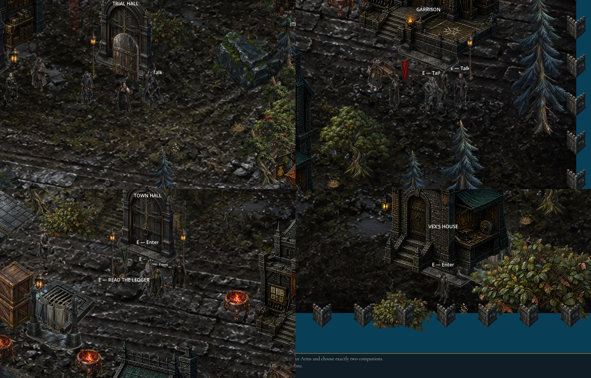
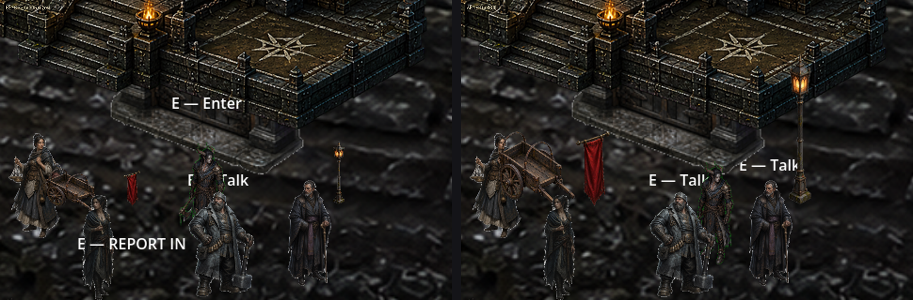

# Dom set-dressing scale pass — #464

Follow-up to #305 / PR #459. Base: `main` at `8b7b2f6b`.
The Dom props were drawn at the old kit sizes beside the 112 px adult (`UnitArt.TARGET_ACTOR_HEIGHT_PX`).
This pass changes only Sprite2D `scale` and `offset` in `world/starting_town.tscn`.
Node positions, paths, UIDs, collision, navigation, interaction areas and the Blocking layer are unchanged.

## Sizes at zoom 1 (alpha bounds)

Each rescaled prop uses a uniform scale, which restores the painted aspect ratio that #305's per-axis fit had squashed.
`offset.y` is recomputed so the bottom of the alpha bounds stays on #305's anchor (`previous_bottom_y` in the manifest).
`offset.x` is kept, so the horizontal center is also unchanged.

| Texture | Uses | Before | After | Scale | Reasoning |
| --- | ---: | --- | --- | ---: | --- |
| `dom-gate--arched.png` (Trial Hall door leaf) | 1 | 26×46 | **88×160** | 0.6452 | Passable door: about 1.4× adult height. It fills the facade's painted arch. |
| `dom-lantern--street.png` | 10 | 12×67 | **23×160** | 0.6452 | Street lamp post with the lamp head just above head height. |
| `dom-cart--high.png` | 2 | 62×49 | **81×88** | 0.3548 | The bed is at waist height, the hoops are at chest height, and the wheel is hip high. |
| `dom-banner--green.png` | 1 | 18×40 | **35×80** | 0.3226 | Hanging banner, about 0.7× adult height. |
| `dom-banner--red.png` | 2 | 18×38 | **35×80** | 0.3226 | Same as the green banner. |
| `dom-stall-bench--plank.png` | 1 | 38×26 | **78×50** | 0.3145 | Plank bench drawn diagonally. The legs and seat are about knee high, and its length is about 0.7× an adult. |
| `dom-wall--crenellated.png` | 74 | 64×82 | **64×82 (unchanged)** | — | See below. |

## Border walls not rescaled

A wall taller than an adult would cover a door and the player's spawn point.
The south row's feet are at y = 2229.4.
Vex's house door (`PlayersHouseEntrance`, y 2092) and `SpawnFromPlayersHouse` (y 2132) stand directly in front of `WallBottom17`.
At 150 px, which would make the 140 px spaced pieces continuous, that wall draws from y 2079 down to y 2229.
It would cover the door and the lower half of the freshly spawned player. The spawn shot below shows how close this is.
The tallest wall that keeps the spawn clear is 97 px. That is shorter than an adult and still leaves 40 px gaps at 140 px spacing.
The east wall raises a similar problem. `WallRightBottom01` (foot y 1249) already draws over the `RoadToTheWilds` exit marker at (3500, 1200), and a taller wall would hide the player passing through the exit gap.
Following the issue's "do not move" rule, the walls stay at their #305 size.
A wall pass needs either a layout change or a dedicated straight wall-segment asset.
`test_border_walls_stay_clear_of_the_players_house_door_and_spawn` guards the spawn and door.

## Overlap review

Collision and navigation are untouched, so nothing new is physically blocked.
The visual footprints were checked against every NPC, door, exit, interactable and spawn node in the scene, in y-sort order:

- The lanterns and banners are drawn over their own interactable markers, as #305 intended.
  These include `BellHouseDoor`, `RiverShrineMarker`, `PlayersHouseDoor`, `SavePoint`, `GarrisonDoor`, `TownHallDoor` and `EquipmentShopDoor`.
  The Trial Hall door leaf is drawn over `TrialHallEntrance` and the bench over `ItemShopDoor`.
  Their Area2D interaction radii are unchanged.
- `CartIronCompanies` now reaches 10 px further left over `SellaVarn`, a merchant who already overlapped the old cart.
  In the render she reads as standing at her cart.
  The cart's right edge stays 19 px short of the `GarrisonDoor` marker.
- The exits `NorthRoad`, `WoundLip` and `RoadToTheWilds` are unaffected by these seven props.
- The pre-existing occlusions are unchanged by this pass:
  - `ItemShopBench` sits under an oak canopy and behind a facade-occluder fade.
  - `CartBlobMarket` sits behind the market crates.

## Captures

These are rendered captures, not composites of cutouts.
They were taken with `scripts/test.sh -a test/manual/town_prop_scale_capture.gd` under Xvfb (OpenGL Compatibility, Mesa D3D12) at 1920×1080, camera zoom 1.
Each crop is 1000×640 px at native resolution around the player.

- [town-prop-scale-after.png](town-prop-scale-after.png) has four crops:
  - Top left: the player beside the Trial Hall door leaf and the street lantern.
  - Top right: the player near the Iron Companies cart, the red Garrison banner and a lantern.
  - Bottom left: the Town Hall green banner flanked by two lanterns.
  - Bottom right: the player at `SpawnFromPlayersHouse` just above the unchanged south wall.
- [cart-banner-lantern-before-after.png](cart-banner-lantern-before-after.png) compares the same Garrison street region before and after. It is upscaled 2×. NPC wander positions differ between the runs.

## Verification

| Check | Result |
| --- | --- |
| `SOUL_METER_HEADLESS=1 scripts/test.sh -a test/unit/test_starting_town.gd -a test/e2e/test_first_chapter_journey.gd` | 24/24 passed (6 unit, 18 e2e), exit 0 |
| `scripts/test.sh -a test/integration/test_town_townsfolk.gd` (Xvfb, alone) | 5/5 passed, exit 0 |
| `scripts/test.sh -a test/manual/town_prop_scale_capture.gd` (Xvfb) | 1/1 passed, 5 shots |

Each run used its own fresh `SOUL_METER_TEST_DATA_DIR`.
The runs still print engine diagnostics: `Parameter "data.tree" is null` during the e2e journey, and resources and RIDs still in use at exit. They do not fail the runner, and they were not compared against `main` in this pass.
