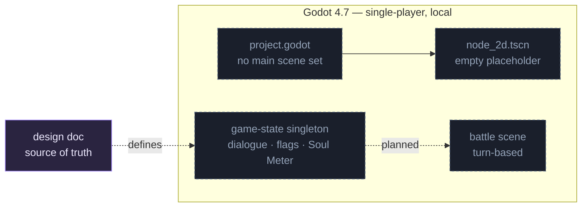

# Architecture: Soul Meter — System Overview

> **TL;DR:** Offline single-player Godot 4.7 CRPG. Mostly *designed*, barely implemented — the design doc is the spec. No scripts or main scene exist yet.

## The shape

## Scope & surface
- **Trust boundary:** none — offline desktop game, no network or backend.
- Almost everything is **planned**: no `.gd` scripts, no `run/main_scene`, one empty `node_2d.tscn`.
- Per design §9, global state (dialogue engine + flag store + Soul Meter) should be one serialized autoload singleton, built chassis-agnostic first.

## Where things live
See `CLAUDE.md` (L0 map) and `soul-meter-crpg-design-doc.md` (the authoritative design). Read the relevant design-doc section before adding any mechanic.

## Related
- [[00-Index/Home]]
